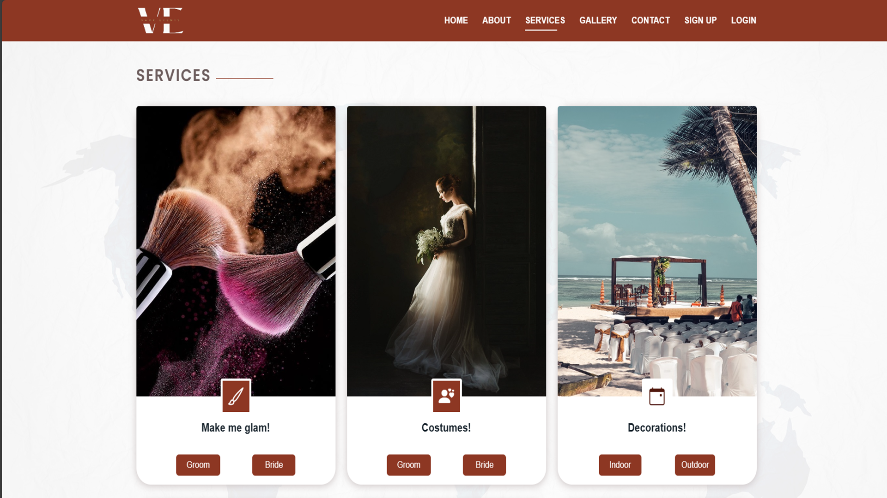

# Vamp Event

Welcome to the Vamp Event project! This Django-based application is your go-to platform for managing and organizing events with ease.

## About

Vamp Event is a comprehensive event management system built using the Django stack. It provides features for creating, scheduling, and managing various types of events, making event planning a breeze.

## Features

- User authentication and authorization system
- Event creation, editing, and deletion functionalities
- RSVP management for attendees
- Seamless integration with Google Maps for event locations

## Installation

1. Clone this repository to your local machine.
2. Install the required dependencies listed in `requirements.txt` using pip.
3. Run migrations to set up the database schema:
    ```
    python manage.py migrate
    ```
4. Start the development server:
    ```
    python manage.py runserver
    ```
5. Open your web browser and navigate to `http://localhost:8000` to access the application.

## Usage

1. Sign up or log in to your account.
2. Create new events or browse existing ones.
3. RSVP to events you're interested in attending.
4. Manage your events as an organizer or administrator.

## Contributing

Contributions are welcome! If you have suggestions, bug fixes, or new features to propose, please feel free to open an issue or submit a pull request.

## License

This project is licensed under the [MIT License](LICENSE).

## Contact

For any inquiries or support, please contact us at [ashok93tidke@gmail.com](mailto:ashok93tidke@gmail.com).
